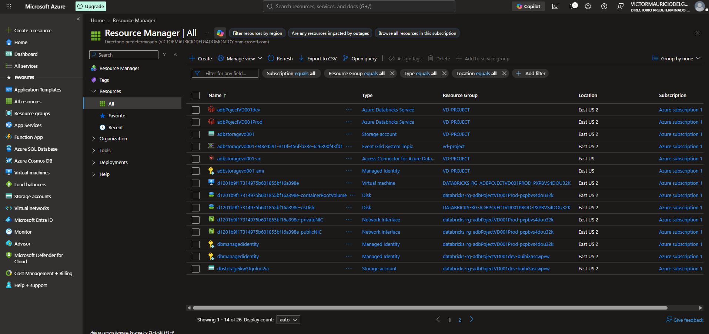
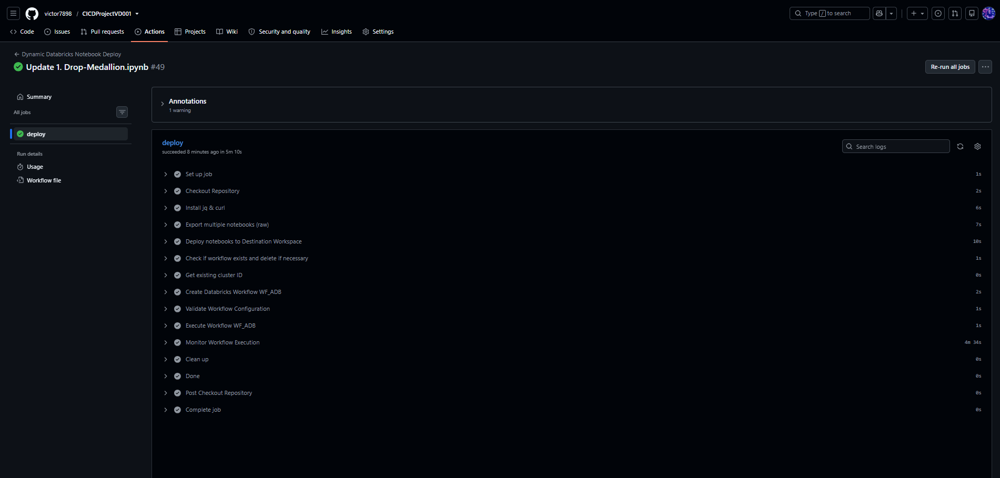
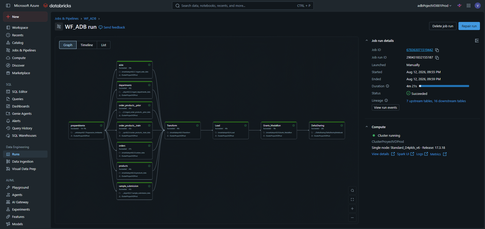

# CICDProjectVD001
Este repositorio consta de entregables para el proyecto final del curso de ingenieria de datos 
# Descripción del repositorio: CICDProjectVD001

## Descripción general

CICDProjectVD001 es un proyecto orientado a la implementación de prácticas de Integración Continua y Despliegue Continuo (CI/CD) para la automatización del ciclo de vida del desarrollo de software y de los procesos de ingeniería de datos.

El objetivo principal del proyecto es automatizar la validación, compilación, prueba e implementación del código mediante herramientas de control de versiones y orquestación de flujos de trabajo, reduciendo los tiempos de entrega, minimizando los errores manuales y garantizando la calidad del software.

## Objetivos del proyecto

* Automatizar la integración del código.
* Estandarizar el proceso de desarrollo.
* Implementar controles de calidad.
* Ejecutar pruebas automáticas.
* Desplegar los cambios de forma controlada.
* Facilitar la colaboración entre los equipos de desarrollo.

## Arquitectura del proyecto

El flujo de trabajo del repositorio sigue las siguientes etapas:

1. Desarolllar el ambiente de trabajo por mediod e AZURE.

2. Ejecución y rpuebas en ambiente de desarollo de Databricks
2. Almacenamiento del código en Git.

3. Ejecución automática del pipeline.

7. Despliegue en el entorno de destino.

## Tecnologías utilizadas

* Git.
* GitHub.
* GitHub Actions.
* Python.
* YAML.
* Herramientas de automatización.
* Servicios en la nube.

## Estructura del repositorio

* `.github/workflows`: definición de los flujos de integración y despliegue.
* `src`: código fuente del proyecto.
* `tests`: pruebas automatizadas.
* `requirements.txt`: dependencias del proyecto.
* `README.md`: documentación principal.

## Flujo de CI/CD

### Integración continua (CI)

Cada vez que se realiza un cambio en el repositorio:

* Se descarga el código.
* Se instalan las dependencias.
* Se ejecutan las validaciones.
* Se realizan pruebas automáticas.
* Se verifica la calidad del código.

### Despliegue continuo (CD)

Una vez que las pruebas finalizan correctamente:

* Se generan los artefactos.
* Se prepara el entorno.
* Se despliega la nueva versión.
* Se valida el resultado del despliegue.

## Beneficios

* Reducción de errores manuales.
* Mayor velocidad de desarrollo.
* Implementaciones más seguras.
* Mejor control de versiones.
* Mayor trazabilidad.
* Entregas continuas y automatizadas.

## Conclusión

CICDProjectVD001 representa una implementación práctica de los principios de DevOps y CI/CD. El proyecto demuestra cómo automatizar tareas repetitivas, mejorar la calidad del código y optimizar los procesos de desarrollo mediante la integración de herramientas modernas de automatización.

La información se puede evaluar deade un Dashboard completo en el ambiente de Databricks y se crea un delta sharing con el fin de compartir una vista general en PowerBI.
